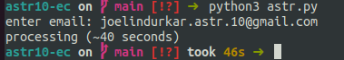
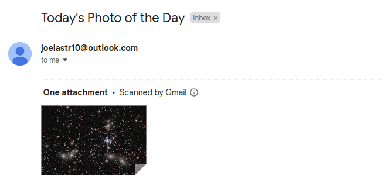

Program accesses NASA's picture of the day webpage and sends the user an email with the picture. 

I made a script using Python that obtains NASA’s Astronomy Picture of the Day and emails it to
the specified user. By using web scraping techniques, the script fetches the latest image from
NASA's Astronomy Picture of the Day website, where a new astronomical image or photograph
is showcased each day, along with a brief description written by a professional astronomer. The
automated email delivery adds convenience and enables users to enjoy a daily dose of
interesting astronomical wonders without having to manually look for it.

USAGE:

RESULT:

Preliminaries:
   - python3
      - pip3 install requests

